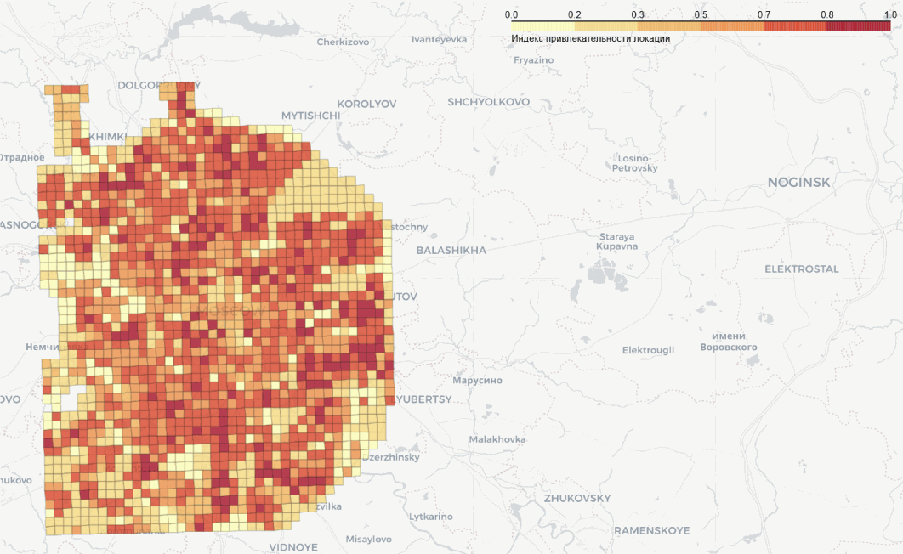

# Анализ благоприятных зон для открытия кафе в Москве

**Учебный проект** | НИУ ВШЭ, Высшая школа бизнеса  
**Год:** 2025  
**Команда:** Арустамян М., Раднаев А., Сагатов А.

---

## О проекте

Геоаналитический проект по оценке привлекательности локаций для открытия кафе
в Москве (в пределах МКАД). Город разбивается на **1709 ячеек 800×800 м**,
по каждой собираются внешние признаки — трафик, конкуренция, аренда,
инфраструктура — и рассчитывается интегральный **индекс привлекательности**.

---

## Стек

`Python` `Pandas` `GeoPandas` `Shapely` `OSMnx` `Folium` `Selenium`  
`Matplotlib` `Seaborn` `Requests` `NumPy` `Google Colab`

---

## Источники данных

| Источник | Что собирали |
|---|---|
| Портал открытых данных Правительства Москвы | Кафе и рестораны, метро |
| 2ГИС API | POI: школы, вузы, ТЦ, рейтинги заведений |
| CIAN (парсинг) | ~13 720 объявлений аренды по станциям метро |
| Wikipedia | Годовой пассажиропоток станций метро |
| OpenStreetMap (osmnx) | Уличная сеть, walkability |

---

## Индекс привлекательности
attractiveness_index =

0.40 × daily_foot_traffic_norm   # пешеходный поток

0.25 × average_cafe_rating_norm  # средний рейтинг кафе в зоне

0.15 × poi_count_norm            # насыщенность инфраструктурой

− 0.30 × chain_cafe_count_norm     # конкуренция со стороны сетей

− 0.30 × cafe_count_norm           # общая плотность конкурентов

− 0.20 × avg_price_rent_norm       # стоимость аренды

Коэффициенты подбирались эмпирически на основе корреляционного анализа признаков.

---

## Пайплайн

Построение сетки 800×800 м внутри МКАД
Сбор данных о кафе, POI, парковках → агрегация по ячейкам
Привязка станций метро → расстояние, пассажиропоток
Расчёт walkability по уличной сети (osmnx)
Парсинг CIAN → средняя аренда по станциям метро
Нормализация признаков
Расчёт attractiveness_index
Визуализация: тепловые карты, срезы по признакам

---

## Ключевые выводы

- **Центр Москвы** — не оптимален: высокая аренда и плотная конкуренция
  перекрывают преимущества трафика
- **Зоны 5–10 км от центра** показывают наилучший баланс: адекватная аренда,
  достаточный поток, умеренная конкуренция
- **Периферия у МКАД** проигрывает по трафику и инфраструктуре даже при
  низких ставках аренды

---

## Структура репозитория
├── notebooks/

│   ├── main_file.ipynb               # Основной анализ и расчёт индекса

│   ├── PointsOfInterest.ipynb        # Сбор POI (школы, вузы, ТЦ, OSM/2ГИС)

│   ├── metro_traffic_final.ipynb     # Пассажиропоток метро

│   ├── openmoscowdata.ipynb          # Данные об общепите Москвы

│   └── parking_plus_traffic.ipynb    # Парковки и трафик

├── src/

│   └── cian_parsing_final.py         # Парсер CIAN (Selenium)

├── data/

│   ├── cian/                         # Результаты парсинга CIAN

│   ├── food/                         # Данные по кафе и ресторанам

│   ├── grid/                         # Файлы сетки

│   ├── metro/                        # Данные по станциям метро

│   └── POI.csv                       # Итоговый набор точек интереса

├── docs/

│   └── presentation.pdf

└── logs/

└── parser_2025-11-05_22-44-21.log

---

## Технические детали

**Парсинг CIAN** — Selenium + ChromeDriver с автоустановкой через
`webdriver_manager`. Реализована ротация cookies для обхода блокировок,
дедупликация объявлений по ссылкам.

**API 2ГИС** — из-за лимитов бесплатного тарифа создано ~25 API-ключей
с параллельной ротацией через `concurrent.futures`, что позволило избежать
ошибок при сборе данных по 1709 ячейкам.

---

## Возможное развитие

Добавить ML-модель, которая по признакам ячейки предсказывает потенциальную
выручку и вероятность успеха точки.
